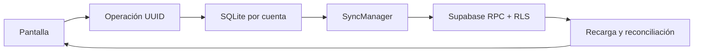

# Arquitectura de Marea

## Separación

`mobile/src/app` contiene rutas Expo Router; `features` pantallas/hooks por capacidad; `components` UI compartida; `domain` modelos/contratos; `data/repositories` consultas Supabase; `services` caché, fotos y sincronización. `backend/supabase/migrations` define PostgreSQL/RLS/RPC. `backend/oauth-relay` es un servicio Node independiente para el retorno Google. No hay secretos administrativos en componentes.

No agregamos Redux ni un framework de formularios: contexto de sesión, estado local, repositorios y hooks bastan. Las funciones RPC concentran operaciones atómicas que requieren autorización y deduplicación. Los tipos de PostgreSQL se generan con Supabase CLI.

## Datos y cola

`getSocialRuntime(userId)` abre una base por usuario y conserva snapshots y operaciones. La cola es la fuente durable de acciones pendientes; los hooks la superponen a las lecturas remotas. Los likes expresan un valor deseado, no un toggle remoto. Comentarios/mensajes mantienen su UUID durante reintentos. `SyncManager.requestRun` comparte una promesa por worker. `SqliteSyncOperationStore.leaseNext` usa una transacción exclusiva; bloquea adelantar operaciones posteriores durante backoff de la primera. Una operación rechazada permanentemente queda visible y requiere reintento explícito.

`SyncStatus` inicia sincronización en red recuperada, al volver a primer plano y cada cinco segundos con la app activa. No se promete ejecución con proceso cerrado. La sesión de Supabase se restaura antes de activar el runtime. El ejecutor comprueba que la identidad sigue coincidiendo con la base.

Los snapshots están limitados a 250 claves; listas usan cursores (created_at,id). La caché de contenido no confiere permisos para futuras consultas; RLS vuelve a evaluarse en el servidor.

## Feed e imágenes

`list_posts` aplica RLS con security invoker, filtra feed por relaciones y devuelve páginas de 20. `SupabaseFeedRepository` resuelve imágenes privadas con URLs firmadas. `usePosts` restaura snapshots, obtiene página y superpone operaciones pendientes.

`ImageCacheManager` mantiene un LRU de imágenes codificadas en RAM (24 MiB de coste estimado conservador) y `ExpoImageFileStore` otro en disco (256 MiB). RAM guarda data URI; disco guarda bytes + metadatos SQLite. Una URL comparte descarga entre consumidores. Al abandonar el último consumidor se aborta la descarga. El feed informa visibilidad y desmonta imágenes fuera de pantalla. Las imágenes se reducen a lado máximo 1600 al elegirlas; FlatList monta una ventana pequeña.

Las imágenes decodificadas visibles son memoria nativa adicional: los 24 MiB no son un límite de memoria total de la aplicación. Perfil y Explore usan miniaturas en cuadrícula; el contenido remoto no debe superar límites Storage.

## Realtime

`SupabaseChatRepository` consulta inbox/historial y se suscribe a Postgres Changes. El typing usa un canal privado `conversation:UUID` autorizado en `realtime.messages`; caduca tras 3,5 segundos sin señales. Al resuscribirse se recarga historial para recuperar eventos perdidos. `mergeMessages` deduplica UUID y conserva estados monotónicos.

`acknowledge_messages` autentica al receptor y actualiza receipts sin retroceder delivered/read. El inbox confirma entrega al recibir metadata; una conversación enfocada y activa marca leído. Todo listener/canal/timer se elimina al salir.

## Seguridad

RLS protege posts/media/likes/comments/stories por visibilidad, actividades por destinatario, mensajes/recibos por membresía. Las membresías solo nacen mediante `get_or_create_direct_conversation`, que autoriza al destinatario y serializa por pareja. Storage es privado; las políticas exigen ruta propiedad del usuario. RPC idempotentes usan advisory locks y `client_operations`.

Username, nombre, biografía y avatar son información pública entre usuarios autenticados para permitir búsqueda; privacidad restringe publicaciones, stories y listas sociales ajenas. Documentamos esta política en la UI. Las URL firmadas son capacidades temporales de una hora; su revocación no es instantánea y no elimina copias offline.

## Navegación y autenticación

Cada grupo de `(tabs)` tiene Stack propio. Post/profile reutilizan pantallas de features dentro de cada stack y mantienen rutas externas `/post/:id`, `/profile/:username`. `useSocialNavigation` conserva el grupo actual. Expo Go comparte enlaces `exp://.../--/...`; el scheme `marea` se usa en instalación propia.

Auth por contraseña, recuperación OTP y Google PKCE. Google usa retorno web separado para evitar depender de un scheme nativo en Expo Go. Configuración en GOOGLE.md.

